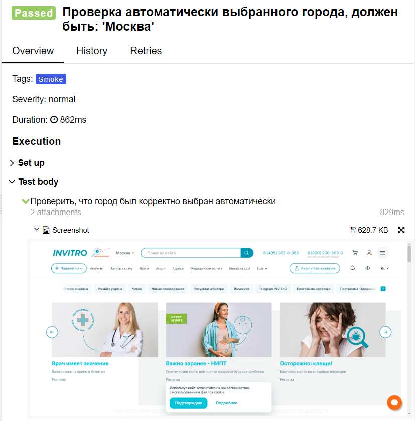
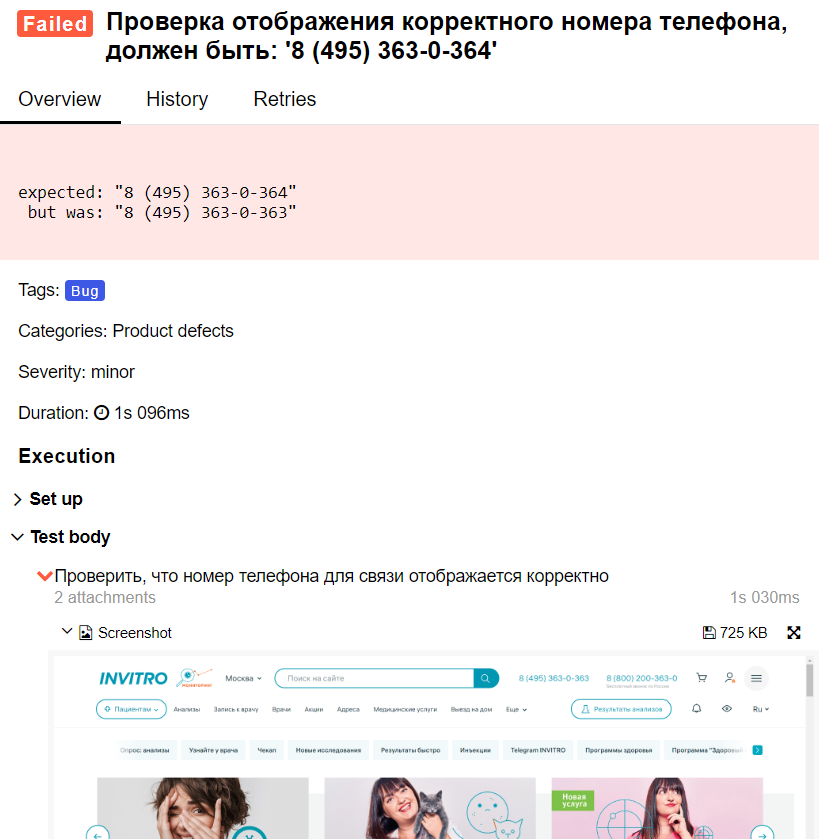

# Проект автотестов на [invitro.ru](https://www.invitro.ru/)

##  Реализованы проверки:

Ui:
- Проверка отображения логотипа компании на странице
- Проверка автоматически выбранного города
- Проверка отображения корректного номера телефона
- Проверка отображения корректного номера телефона для бесплатных звонков
- Проверка наличия результатов поиска
- Проверка отображения элементов главного меню хедера
- Проверка отображения элементов главного меню футера

##  Отчеты в Allure Report
- Пример прикрепленного скриншота:

- Пример вывода ошибки при падении теста:

